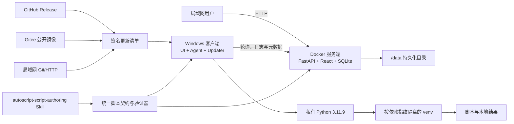

# AutoScript Hub 0.9 发布候选设计

- 日期：2026-07-21
- 状态：方案已批准，0.9 实施与验收中
- 目标版本：0.9 Beta，可从同一验收提交晋级 1.0 Stable
- 适用仓库：`CZF39631/AutoScript_Hub`

## 1. 目标

AutoScript Hub 0.9 要从“需要源码和开发环境才能运行”的项目，升级为可以交给真实用户验收的发布候选版：

1. 服务端通过 Docker Compose 部署在局域网 Linux 主机上，同时支持 `linux/arm64` 和 `linux/amd64`。
2. Windows 10/11 客户端通过单一安装程序交付，不要求用户预装 Python、Node.js 或 Git。
3. 客户端内置官方私有完整 Python 3.11.9，并为不同脚本依赖创建独立、可缓存的虚拟环境。
4. 客户端通过公开 GitHub、公开 Gitee 或局域网 Git/HTTP 更新清单受控更新，不执行源码覆盖或 `git pull`。
5. 仓库和 Release 提供 AI Skill，帮助用户创建、审查、修复、验证和打包平台脚本。
6. 所有升级路径都有校验、备份、失败回退和可读日志。
7. 0.9 通过自动化验证和用户验收后，可在完全相同的提交上创建 `v1.0.0` 标签并重新构建 Stable 产物。

## 2. 已确认的产品边界

| 主题 | 已确认决策 |
| --- | --- |
| 服务端网络 | 主要供局域网使用；0.9 不要求公网域名或 HTTPS |
| Linux 架构 | 必须支持 `linux/arm64` 和 `linux/amd64`；不支持 32 位 `linux/386` |
| 服务端数据库 | 0.9 保持 SQLite、单后端实例；不引入 PostgreSQL 或多副本 |
| Windows 架构 | 0.9 交付 Windows x86-64；Windows ARM64 和 32 位 Windows 不在范围内 |
| Windows 运行时 | 安装器携带官方私有完整 Python 3.11.9，不依赖系统 Python |
| 脚本依赖 | 按依赖指纹创建独立虚拟环境，准备完成后可离线复用 |
| 结果文件 | 保留在实际执行脚本的客户端；服务器只保存执行元数据和同步日志 |
| 更新源 | 支持公开 GitHub、公开 Gitee、公开或局域网 Git/HTTP 清单；0.9 不支持客户端私有仓库鉴权 |
| AI 能力 | 交付仓库内 Skill 和独立 Skill ZIP；0.9 客户端不内置在线 AI |
| 发布通道 | 0.9 使用 `beta`；用户接受后从同一提交构建 1.0 `stable` |
| Windows 代码签名 | Authenticode 证书不是 0.9 阻塞项；更新清单签名和安装包哈希仍为必选 |

## 3. 当前状态与发布差距

当前仓库已经具备 FastAPI 服务端、React 前端、pywebview 客户端、在线与离线执行、日志同步和一个源码式更新器，但还不能作为 0.9 发布：

- 仓库没有 Dockerfile、Compose、GitHub Actions、PyInstaller 配置或 Inno Setup 脚本。
- 当前安装流程要求本机已有 Python 和 Node.js，并在目标机器上执行前端构建。
- 当前客户端更新器下载 ZIP 后覆盖源码，再用 Python 重新启动；冻结后的 EXE 无法使用该流程。
- 当前客户端把 `sys.executable` 当作脚本 Python；冻结后它会指向应用 EXE，而不是可运行脚本和 `pip` 的解释器。
- 服务端配置主要读取仓库根目录的 `config.json`，运行数据使用源码树内路径，不适合不可变容器。
- SQLite 模式变更由 `init_db.py` 中的零散 `PRAGMA` 处理，没有正式迁移链。
- 后端和客户端都能解析 `config()`，但缺少一份被上传、执行和 AI Skill 共用的严格脚本契约。
- 现有平台设计中仍有“结果上传服务器”的旧描述，与已经确认的“结果只保留在客户端”边界冲突。

0.9 实施应修复这些发布差距，同时保留现有在线、离线、角色、脚本、执行、日志和问题反馈功能，不做无关重写。

## 4. 总体架构



所有关键边界各有一个明确所有者：

- Docker 镜像负责服务端程序和前端静态资源。
- `/data` 负责服务端所有持久状态。
- Windows 安装器负责不可变客户端程序和私有 Python 基础运行时。
- `%LOCALAPPDATA%\AutoScriptHub` 负责客户端可变数据。
- 更新清单负责版本与安装包的发布契约。
- 共享脚本契约负责平台脚本是否合法。
- AI Skill 负责指导 AI 使用该契约，不复制一套互相漂移的规则。

## 5. 版本与发布规则

### 5.1 版本真源

- Git 标签是发布版本的最终真源。
- `v0.9.0` 构建出的产品版本是 `0.9.0`，通道是 `beta`。
- 非标签开发构建显示 `0.9.0-dev` 和提交短哈希。
- 构建流程校验标签符合 SemVer，不在多个源文件中手工维护相互独立的版本号。
- 客户端、服务端健康响应、安装器、Docker 标签、更新清单和 Release 名称必须使用同一构建版本。

### 5.2 镜像标签

服务端镜像名称：

`ghcr.io/czf39631/autoscript-hub-server`

0.9 发布同时生成：

- `0.9.0`
- `0.9`
- `beta`

1.0 正式发布后才生成：

- `1.0.0`
- `1.0`
- `stable`
- `latest`

0.9 不占用 `latest`，避免测试版被误当成稳定版部署。

## 6. Linux 服务端 Docker 设计

### 6.1 镜像构建

- 使用多阶段 Dockerfile。
- Node.js 20 阶段执行 `npm ci`、测试和前端生产构建。
- Python 3.11 Slim 阶段安装后端运行依赖并复制前端静态资源。
- 最终镜像不包含 Node.js、npm 缓存、测试依赖或源码构建缓存。
- 容器使用非 root 用户运行。
- Buildx 生成同一个多架构清单，包含 `linux/arm64` 和 `linux/amd64`。
- CI 分别启动两种架构镜像进行健康检查，再允许发布清单。

### 6.2 Compose 拓扑

0.9 只有一个应用服务：

```text
autoscript-hub-server
  ├─ FastAPI API
  ├─ React 静态页面
  ├─ 单实例调度器
  └─ SQLite 数据库连接
```

Compose 默认把容器 `8000` 端口映射到主机 `0.0.0.0:${AUTOSCRIPT_PORT:-8000}`，使同一局域网设备可以通过 `http://服务器局域网IP:8000` 访问。公网反向代理和 HTTPS 作为文档化扩展存在，不属于 0.9 必验路径。

### 6.3 持久化布局

推荐主机绑定目录：

`/opt/autoscript-hub/data:/data`

容器内布局：

```text
/data/
  autoscript.db
  scripts/
  logs/
  logs/archive/
  backups/
  tmp/
```

- 数据库、脚本、日志、归档和备份必须全部离开镜像层。
- 更新、重建和删除容器不能删除 `/data`。
- 临时文件只写入 `/data/tmp` 或系统临时目录，成功后原子移动到正式位置。
- Compose 和部署脚本在首次启动前创建目录并校验容器用户可写。

### 6.4 运行配置

生产配置通过环境变量和 `.env` 注入，至少包括：

- `AUTOSCRIPT_VERSION`：构建注入，只读。
- `DATABASE_URL=sqlite:////data/autoscript.db`。
- `JWT_SECRET`。
- `ADMIN_USERNAME`、`ADMIN_PASSWORD`：只用于首次初始化空数据库。
- `BACKEND_HOST=0.0.0.0`、`BACKEND_PORT=8000`。
- `DATA_DIR=/data`。
- `LOG_LEVEL`、`LOG_RETENTION_DAYS`、`LOG_ARCHIVE_RETENTION_DAYS`。
- `CORS_ORIGINS`：默认同源和明确的局域网来源，不使用任意生产通配配置。

`.env.example` 只包含占位值和说明。镜像、Compose、README 和 Release 包中不写入真实密钥。

### 6.5 健康检查

- `GET /api/health` 是存活检查，返回版本和进程状态。
- `GET /api/health/ready` 是就绪检查，验证数据库可查询、`/data` 可写且迁移处于最新版本。
- Docker healthcheck 使用就绪端点。
- 升级脚本只有在连续通过就绪检查后才把新版本标记为成功。

### 6.6 SQLite 与单实例约束

- 0.9 明确只允许一个后端副本。
- SQLite 使用 WAL、busy timeout 和合理的连接配置。
- 调度器与数据库位于同一实例，避免重复调度。
- 5–20 人的局域网使用是目标规模；多实例和 PostgreSQL 在 1.x 重新评估。

## 7. 数据迁移、备份与回滚

### 7.1 Alembic 迁移

- 使用 Alembic 替代 `init_db.py` 中的零散结构迁移。
- 全新数据库通过 `alembic upgrade head` 创建完整结构。
- 已有数据库在第一次 0.9 升级时先备份，再检查已知旧结构，写入基线版本并执行有序迁移。
- 迁移脚本对已知旧字段采用显式检测，避免同一字段重复添加。
- 未识别的数据库结构拒绝自动升级，并保留原库和诊断信息。
- 应用不会在请求处理中临时修改表结构。

### 7.2 备份

`ops/server/backup.sh` 执行：

1. 调用 SQLite 在线备份 API 生成一致的数据库副本。
2. 归档数据库副本、脚本目录和需要保留的日志元数据。
3. 写入备份清单，记录应用版本、迁移版本、时间、文件大小和 SHA-256。
4. 把产物写入 `/data/backups/<timestamp>-<version>/`。

真实 `.env` 不默认打入数据备份；运维文档要求管理员在受控位置单独备份它。

### 7.3 恢复与升级

- `ops/server/restore.sh` 只在服务停止时恢复，并先验证备份清单和哈希。
- `ops/server/upgrade.sh <version>` 的顺序固定为：备份、停止、拉取目标镜像、迁移、启动、就绪检查。
- 若迁移、启动或就绪检查失败，升级脚本恢复旧镜像标签和升级前备份。
- `ops/server/rollback.sh <version> <backup>` 提供明确的人工回滚入口。
- 回滚不会猜测数据兼容性；必须指定与旧版本匹配的升级前备份。

## 8. Windows 客户端交付

### 8.1 安装包

- GitHub Actions Windows Runner 使用 PyInstaller `onedir` 构建，再使用 Inno Setup 生成单一安装程序。
- 文件名为 `AutoScript-Hub-Setup-<version>.exe`。
- 默认按当前用户安装到 `%LOCALAPPDATA%\Programs\AutoScript Hub`，不要求管理员权限。
- 安装器携带官方完整 Python 3.11.9 x86-64 安装程序，以静默、私有、无 PATH 污染的方式安装到应用管理的运行时目录。3.11.9 是 Python 官方最后一个提供 Windows 二进制安装器的 3.11 版本；后续 3.11 安全维护版本仅提供源码。
- 不使用官方 Python embeddable ZIP 作为脚本环境，因为脚本需要正常使用 `venv` 和 `pip`。
- Inno Setup 使用高压缩并在 CI 中执行小于 95MB 的门槛检查，以适配 Gitee 100MB 单附件限制。

### 8.2 进程划分

安装目录至少提供：

- `AutoScriptHub.exe`：桌面 UI、首次配置、更新提示和用户操作入口。
- `AutoScriptAgent.exe`：独立后台 Agent，负责轮询、执行、日志与离线同步。
- `AutoScriptUpdater.exe`：独立更新辅助程序，负责等待进程退出、运行安装器和回退。

多个 EXE 使用同一个 PyInstaller `onedir` 依赖集合，避免复制相同运行库。脚本永远不通过这些冻结 EXE 执行，而是通过私有 Python 3.11.9 或对应虚拟环境中的 `python.exe` 执行。

关闭 UI 不会直接结束正在运行的脚本。Agent 独立保持运行，UI 再次打开时通过本地 API 恢复状态。开机自启动可以由用户选择，但不是 0.9 强制默认行为。

### 8.3 客户端可变数据

```text
%LOCALAPPDATA%\AutoScriptHub\
  config\
  scripts\
  environments\
  logs\
  runs\
  updates\
  output\
```

- 安装、升级和程序目录替换不覆盖这些数据。
- 普通卸载默认保留用户数据，并提供显式“同时删除本地数据”选择。
- 客户端路径解析以该数据根目录为准，不依赖仓库根目录或当前工作目录。

### 8.4 WebView2

- 客户端启动时检测 Microsoft Edge WebView2 Runtime。
- 缺失时由安装器运行 Evergreen Bootstrapper，并给出明确的联网安装提示。
- 0.9 单一安装包不内置体积较大的固定版 WebView2 Runtime，以保留 Gitee 附件体积预算。
- Windows 10/11 验收机必须验证检测、正常启动和缺失提示路径。

## 9. 私有 Python 与脚本虚拟环境

### 9.1 环境指纹

脚本环境指纹由以下内容规范化后计算 SHA-256：

- 私有 Python 的完整版本；0.9 固定为 `3.11.9`。
- Windows 架构。
- 排序和规范化后的 `requirements`。
- 影响安装结果的 pip 索引配置。

虚拟环境路径：

`%LOCALAPPDATA%\AutoScriptHub\environments\<fingerprint>`

相同指纹复用同一环境，不同依赖集合完全隔离。

### 9.2 创建流程

1. 对指纹获取本机文件锁，避免重复并发创建。
2. 在同级临时目录创建 `venv`。
3. 使用该环境的 `python -m pip` 安装依赖。
4. 执行 `pip check` 和解释器启动冒烟测试。
5. 写入环境元数据，包括 Python、依赖、创建时间和状态。
6. 成功后原子重命名到正式指纹目录。

创建失败时删除临时环境、保留已存在的可用环境，并向 UI 返回可操作错误。客户端允许配置 pip 索引地址以适配国内网络，但默认保持官方 PyPI。

### 9.3 在线与离线规则

- 在线时可以创建缺失环境并下载依赖。
- 离线时只允许使用已经完成并通过检查的环境。
- 离线缺少环境时不尝试伪安装，直接提示需要联网准备哪些依赖。
- 更新客户端不会无条件删除脚本环境；只有 Python ABI 或契约版本不兼容时才创建新指纹。

## 10. 受控客户端更新

### 10.1 更新源

0.9 支持两类读取方式：

1. GitHub Releases 适配器：根据公开仓库、通道和 Release 资产找到签名清单。
2. 直接清单适配器：读取公开 Gitee、公开 Git、局域网 Git raw URL 或普通 HTTP 地址。

客户端不安装 Git、不克隆仓库、不运行 `git pull`，也不保存 GitHub/Gitee Token、账号密码或 SSH Key。私有仓库鉴权留给 1.x。

### 10.2 更新清单

清单使用稳定、版本化的 JSON 结构：

```json
{
  "schema_version": 1,
  "product": "autoscript-hub-client",
  "version": "0.9.1",
  "channel": "beta",
  "published_at": "2026-07-21T00:00:00Z",
  "minimum_client_version": "0.9.0",
  "release_notes_url": "https://example.invalid/release-notes",
  "assets": {
    "windows-x86_64": {
      "filename": "AutoScript-Hub-Setup-0.9.1.exe",
      "size": 73400320,
      "sha256": "0000000000000000000000000000000000000000000000000000000000000000",
      "urls": [
        "https://gitee.example.invalid/download",
        "https://github.example.invalid/download"
      ]
    }
  }
}
```

示例域名和值只表示结构，不会作为运行时默认地址。真实清单在发布时生成。

- CI 对清单原始字节生成独立 Ed25519 签名文件 `autoscript-hub-update.json.sig`。
- 客户端内置官方公钥，先验证清单签名，再解析 JSON。
- 安装包下载后校验长度和 SHA-256。
- GitHub 和 Gitee 镜像提供相同的已签名清单，清单内包含有序下载镜像。
- 国内默认顺序是 Gitee、GitHub；管理员可在局域网配置中把内部镜像放到首位。

### 10.3 更新状态机

```text
idle
  -> checking
  -> available
  -> downloading
  -> verified
  -> waiting-for-idle
  -> installing
  -> verifying-startup
  -> succeeded
```

任何检查、下载、签名或哈希错误都回到 `idle` 并继续运行当前版本。安装失败或新版本没有在规定时间内写入启动成功标记时，Updater 静默重装保留的上一版本安装包。

- 启动时检查一次，运行期间默认每 6 小时检查一次。
- 可以后台下载，但必须由用户选择安装时机。
- 脚本执行期间只进入 `waiting-for-idle`，不得终止脚本完成更新。
- 更新目录保留当前下载、上一版本安装包、状态文件和更新日志。
- 版本比较使用 SemVer，默认禁止意外降级；人工回滚是显式操作。

## 11. 统一脚本契约

### 11.1 单一所有者

0.9 新增版本化的共享脚本契约模块。后端上传、客户端本地解析、执行前检查、测试工具和 AI Skill 都使用同一契约或同一版本化快照。CI 校验快照版本和内容一致，禁止各模块维护互相冲突的字段列表。

### 11.2 文件结构

- 单文件脚本使用 `.py`，必须包含 `config()` 和 `main()`。
- 多文件脚本使用 `.zip`，规范结构要求根目录存在 `main.py`。
- 历史单层目录 ZIP 可以兼容读取，但产生规范警告；AI Skill 输出必须归一化到根目录 `main.py`。
- 拒绝损坏 ZIP、绝对路径、目录穿越路径和无法安全提取的成员。

### 11.3 `config()` 规则

`config()` 必须在 10 秒内返回 JSON 可序列化对象，且不执行真实业务。规范脚本包含：

- 非空 `name`。
- SemVer 格式的 `version`。
- `description` 和 `category`。
- `params` 数组。
- `requirements` 数组。
- 合理的正整数 `timeout`。
- 可选 `presets`。

模块顶层和 `config()` 不能依赖尚未安装的第三方包，也不能启动浏览器、访问网络、修改业务文件或执行主流程。第三方业务依赖应在 `main()` 或它调用的业务模块中延迟导入，使服务器能在安装脚本依赖前读取配置。

参数类型仅支持：

- `text`
- `number`
- `file`
- `folder`
- `select`
- `checkbox`

参数 key 必须唯一、是合法 Python 标识符且不是 Python 关键字。验证器同时检查：

- `number` 的默认值、`min`、`max` 和范围关系。
- `select` 的非空 options 和默认值。
- `checkbox` 的布尔默认值。
- `file`、`folder` 的客户端存在性规则和 `auto_create`。
- preset 只能引用已声明参数，且值类型和选项有效。
- requirements 符合 PEP 508、去重后稳定排序。

### 11.4 `main()` 与结果

- `main()` 参数必须覆盖 config 中声明的所有 key；允许明确的默认参数或 `**kwargs`，但不能产生必然无法调用的签名。
- 验证阶段不执行实际 `main()` 业务。
- 实际运行结果只允许 `None`、本地文件路径字符串或本地文件路径字符串列表。
- Agent 将结果规范化为名称、绝对路径和存在状态元数据；文件本身不上传服务器。

### 11.5 错误和警告

- 错误：阻止上传、打包或执行，例如缺失函数、非法字段、参数签名不匹配、无法解析依赖。
- 警告：平台可以兼容但不符合 0.9 规范，例如历史单层目录 ZIP 或缺少推荐说明字段。
- AI Skill 的交付标准是零错误、零警告。

## 12. AI Skill 设计

Skill 名称：`autoscript-script-authoring`

仓库路径：

`skills/autoscript-script-authoring/`

结构：

```text
autoscript-script-authoring/
  SKILL.md
  agents/openai.yaml
  scripts/validate_script.py
  scripts/package_script.py
  references/script-contract.md
  assets/templates/single-file.py
  assets/templates/multi-file/main.py
```

不创建与 Skill 执行无关的 README、安装指南或变更日志。

### 12.1 支持的任务

- 根据自然语言创建平台脚本。
- 审查现有 `.py` 或 `.zip` 并输出分级问题。
- 在不改变用户业务意图的前提下规范化旧脚本。
- 修复 `config()`、`main()`、参数定义、依赖、预设和结果返回。
- 调用确定性验证器，修复到零错误、零警告。
- 生成规范 `.py` 或根目录含 `main.py` 的 `.zip`。
- 输出修改摘要、依赖、假设、验证命令和结果。

### 12.2 实现与验证

- 使用官方 Skill 初始化脚本创建目录和元数据。
- `SKILL.md` 保持精简，把详细契约放入 references。
- `validate_script.py` 复用共享契约，输出机器可读 JSON 和人类可读摘要。
- `package_script.py` 生成稳定、可复现的 ZIP，不包含缓存、venv、日志、结果或密钥文件。
- 使用 Skill 的 `quick_validate.py` 检查 Skill 自身结构。
- 使用正反例测试新建、审查、修复、单文件打包和多文件打包。
- 最终样本必须经过真实后端上传验证，并由客户端私有 Python 环境实际执行。

Release 额外交付 `autoscript-script-authoring-<version>.zip`。0.9 客户端不内置模型、API Key 输入或在线 AI 页面。

## 13. CI/CD 与国内镜像

### 13.1 持续集成

Pull Request 和主分支变更执行：

- Python 3.11 后端、客户端和共享契约测试。
- `pip check` 和 `compileall`。
- 前端 `npm test`、`npm run lint`、`npm run build`。
- Alembic 全新建库和旧库升级测试。
- Skill 结构、验证器、打包器和样本测试。
- Windows 打包配置静态检查。
- Linux amd64 Docker 构建与健康冒烟。

### 13.2 标签发布

`v0.9.*` 或 `v1.*` 标签触发：

1. 重跑完整 CI。
2. Windows Runner 构建 PyInstaller onedir、私有 Python 运行时和 Inno Setup 安装包。
3. Linux Buildx 构建、运行并推送 arm64/amd64 GHCR 镜像。
4. 生成部署包、AI Skill ZIP、校验文件和发布说明。
5. 创建 GitHub draft Release 并上传资产。
6. 创建公开 Gitee Release 并上传相同资产。
7. 收集两个镜像的下载地址，生成并签名最终更新清单。
8. 把清单上传到两端，完成下载和签名回读验证。
9. 发布 GitHub/Gitee Release；任何必需镜像失败都保持未发布状态。

Gitee 是国内分发镜像，GitHub 是代码和发布真源。Gitee 发布使用只存在于 CI Secret 中的 `GITEE_TOKEN`；客户端访问公开资产时不需要该 Token。

### 13.3 发布资产

- `AutoScript-Hub-Setup-<version>.exe`
- `autoscript-hub-update.json`
- `autoscript-hub-update.json.sig`
- `SHA256SUMS.txt`
- `autoscript-script-authoring-<version>.zip`
- `autoscript-hub-server-deploy-<version>.zip`
- GHCR `linux/arm64`、`linux/amd64` 多架构镜像

## 14. 错误处理与日志

### 14.1 服务端

- 启动配置、目录权限、迁移和数据库错误必须使就绪检查失败。
- 容器日志写 stdout/stderr，业务日志和归档写 `/data/logs`。
- 迁移失败不继续启动应用。
- 备份、恢复、升级和回滚脚本都返回非零退出码并写清楚失败步骤。

### 14.2 客户端

- 首次启动向导区分服务器不可达、认证失败、本地 Agent 失败和 WebView2 缺失。
- 环境创建日志记录解释器、指纹、pip 命令结果和失败摘要，不把失败环境标成可用。
- 脚本运行、离线队列、日志同步和结果元数据在进程重启后仍可恢复。
- 更新日志记录来源、版本、下载、签名、哈希、安装退出码、启动确认和回滚结果。
- 用户关闭 UI、服务器断线或更新检查失败不影响正在运行的脚本。

### 14.3 外部监控边界

0.9 提供健康端点、Docker 状态、结构化应用日志和运维检查命令，不引入外部 SaaS 监控、告警或遥测。局域网管理员通过 Compose、健康端点和日志排查问题。

## 15. 测试策略

### 15.1 单元测试

- 版本解析、通道选择和 SemVer 比较。
- 更新清单解析、Ed25519 验签、大小和 SHA-256 校验。
- GitHub Release 和直接清单适配器。
- 环境指纹、并发锁、成功切换和失败清理。
- 脚本契约所有字段、参数、main 签名、requirements、presets 和 ZIP 结构。
- 数据路径迁移和冻结运行时路径解析。

### 15.2 集成测试

- 后端上传合法和非法 `.py`、`.zip`。
- 全新数据库迁移到 head。
- 当前旧数据库副本升级到 head 并保留核心数据。
- SQLite 备份、校验和停止状态恢复。
- 在线执行、离线执行、恢复联网后元数据与日志同步。
- 私有 Python 创建环境、复用环境、依赖失败和离线缺失环境。
- 本地 HTTP 更新源模拟成功、断网、坏签名、坏哈希和版本不兼容。

### 15.3 发布级测试

- Windows Runner 静默安装并启动客户端，断开系统 Python/Node/Git 路径后仍能运行。
- 安装包实际完成 `0.9.0 -> 0.9.1` 更新。
- 更新期间有脚本运行时保持等待，脚本结束后再安装。
- 新版本启动失败时恢复上一版本。
- amd64 镜像原生启动；arm64 镜像在 QEMU/Buildx 下启动并通过健康检查。
- Compose 重建容器后数据库、脚本和日志仍存在。
- Gitee/GitHub 资产能匿名下载，安装包小于 95MB，清单签名相同。
- Skill ZIP 通过自身校验，生成样本通过平台上传和实际执行。

## 16. 0.9 用户验收标准

只有以下项目全部有证据时，0.9 才是“可确认晋级 1.0”的候选版。

### 16.1 服务端

- [ ] 在真实 `aarch64` Linux 主机通过部署包和 Compose 启动。
- [ ] 浏览器从同一局域网访问登录页、登录并完成核心操作。
- [ ] 显示运行版本和健康状态。
- [ ] 重启、重建容器后数据库、脚本和日志仍存在。
- [ ] 完成一次备份、数据变化、停止恢复，并确认恢复结果。
- [ ] 完成一次镜像升级和一次回滚演练。
- [ ] 同一发布的 `linux/amd64` 镜像通过自动化启动与健康检查。

### 16.2 Windows 客户端

- [ ] Windows 10 和 Windows 11 x86-64 至少各完成一次安装或兼容性验收。
- [ ] 不使用系统 Python、Node.js 或 Git 即可启动。
- [ ] 首次向导可以配置局域网服务器并登录。
- [ ] 私有 Python 3.11.9 路径和版本可在诊断信息中确认。
- [ ] 两个不同依赖集合生成不同环境，相同集合复用环境。
- [ ] 在线脚本执行、日志查看和本地结果打开成功。
- [ ] 服务器断开后冷启动、浏览缓存脚本和离线执行成功。
- [ ] 恢复联网后执行元数据与日志同步，结果文件仍只在本机。
- [ ] 关闭 UI 不终止正在运行的脚本。

### 16.3 更新

- [ ] 真实安装版完成 `0.9.0 -> 0.9.1`。
- [ ] GitHub、Gitee、局域网清单均能提供同一签名更新。
- [ ] Gitee 或 GitHub 单一来源不可达时尝试下一镜像。
- [ ] 坏清单签名和坏安装包哈希被拒绝。
- [ ] 脚本运行期间更新不强制安装。
- [ ] 安装或新版本启动失败后可以恢复上一版本。
- [ ] 更新不删除配置、脚本、环境、日志、运行历史或结果。

### 16.4 AI Skill

- [ ] Skill 能根据需求创建一个单文件脚本。
- [ ] Skill 能审查并修复一个不合规旧脚本。
- [ ] Skill 能生成规范多文件 ZIP。
- [ ] `.py` 和 `.zip` 均达到零错误、零警告。
- [ ] 两个产物均能上传平台并由客户端私有环境实际执行。
- [ ] Skill ZIP 可以独立安装和触发。

### 16.5 自动化与文档

- [ ] Python 测试、前端测试、lint、build、compileall 和 pip check 全绿。
- [ ] Windows 安装、更新和回滚发布测试全绿。
- [ ] Docker 双架构构建、启动、健康和持久化测试全绿。
- [ ] README 给出开发启动、Windows 安装和局域网 Docker 启动入口。
- [ ] 运维文档给出升级、备份、恢复、回滚、日志和健康检查命令。
- [ ] Release 包包含所有约定资产、校验和、签名及版本说明。

## 17. 1.0 晋级规则

1. 选择通过第 16 节全部验收的确切提交 SHA。
2. 冻结该提交，不再混入新功能或未验收修复。
3. 用户明确确认 0.9 候选版可晋级。
4. 在同一提交创建 `v1.0.0` 标签。
5. CI 从标签重新构建全部产物，通道改为 `stable`，并发布 `latest` Docker 标签。
6. 对重新构建的 1.0 产物执行签名、哈希、安装、启动和镜像健康冒烟。

0.9 的二进制文件不会简单重命名为 1.0；1.0 必须从同一已验收源码提交可复现地重新构建。

## 18. 明确不在 0.9 范围内

- 公网域名、强制 HTTPS、Caddy 或云负载均衡生产配置。
- PostgreSQL、多后端副本和高可用调度。
- 32 位 Linux、32 位 Windows、Windows ARM64、macOS 或 Linux 桌面客户端。
- 客户端私有 GitHub/Gitee Token、账号密码或 SSH Key 更新。
- 客户端内置在线 AI、模型供应商或 API Key 管理。
- 自动上传脚本结果文件到服务器。
- 外部 SaaS 监控、遥测、收费、支付或多租户能力。
- 强制购买 Authenticode 证书；若 1.0 面向广泛公网下载，应在公开发布前重新评估。

## 19. 发布前外部前置条件

代码实施可以在本地完成，但真实发布和最终验收还需要以下外部条件：

1. 一个公开 Gitee 仓库，用于代码或 Release 镜像。
2. 一个具备该仓库 Release 权限的 Gitee Token，保存为 CI Secret，不写入仓库。
3. 用户的真实 `aarch64` Linux 主机用于最终 Compose 验收。
4. Windows 10/11 x86-64 验收环境。
5. 若希望去除 Windows“未知发布者”提示，需要单独购买并提供 Authenticode 证书；这不是 0.9 当前阻塞项。
6. Python 3.11.9 是最后一个有官方 Windows 安装器的 3.11 版本；如 1.x 继续固定 3.11，应评估从官方源码构建更新安全补丁版，或经兼容性验收迁移到仍提供 Windows 安装器的 Python 系列。

若 Gitee 单一安装包超过 95MB、真实 ARM 主机部署失败或 Windows 安装无法脱离开发环境，0.9 不得标记为可交付，必须修复或重新批准发布边界。

## 20. 完成定义

“0.9 已完成”不是指文件已创建、代码可编译或单元测试通过，而是指：

- 第 13 节发布产物实际生成。
- 第 15 节自动化验证实际通过。
- 第 16 节用户验收逐项有证据。
- 第 19 节需要的真实环境验证已经完成或由用户明确执行并回传结果。
- 没有把未验证、模拟、占位或失败路径描述成成功。

只有满足以上条件，项目才可以交付 0.9，并进入第 17 节的 1.0 晋级流程。

## 21. 主要技术依据

- GitHub Release API：<https://docs.github.com/en/rest/releases/releases>
- GitHub Container Registry：<https://docs.github.com/en/packages/working-with-a-github-packages-registry/working-with-the-container-registry>
- Docker GitHub Actions 多平台构建：<https://docs.docker.com/build/ci/github-actions/multi-platform/>
- PyInstaller 构建与运行时说明：<https://pyinstaller.org/en/stable/usage.html>、<https://pyinstaller.org/en/stable/runtime-information.html>
- Python Windows 安装与可再发行运行时说明：<https://docs.python.org/3/using/windows.html>
- Python 3.11.9（最后一个带 Windows 安装器的 3.11 版本）：<https://www.python.org/downloads/release/python-3119/>
- Python 3.11.15（安全维护版本，仅提供源码）：<https://www.python.org/downloads/release/python-31115/>
- Inno Setup 更新与命令行说明：<https://jrsoftware.org/ishelp/topic_technotes.htm>、<https://jrsoftware.org/ishelp/topic_setupcmdline.htm>
- Gitee Release 附件接口说明：<https://gitee.com/sdk/typescript-sdk-v5/releases>
- Gitee 社区版容量限制：<https://gitee.com/help/articles/4125>
